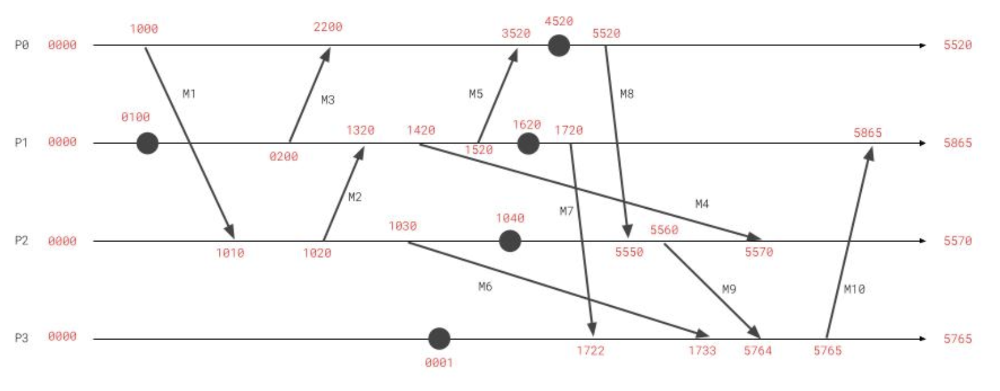
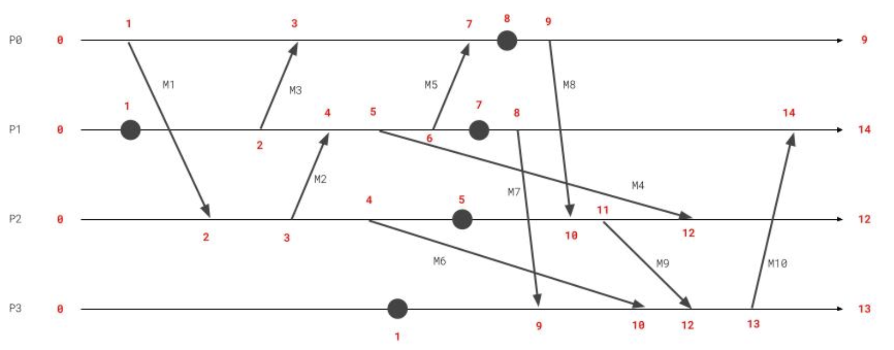

# Vector Clock Simulation

Vector clock and Lamport simulation, written in Python.

- https://en.wikipedia.org/wiki/Vector_clock
- https://en.wikipedia.org/wiki/Lamport_timestamp

## Example

### Vector Clock

For example, let's imagine that you want to simulate the following case.
In the following diagram, those entities are described as follows:

- **4 processes** (P0, P1, P2, P3)
- **25 events** (instructions or messages)
    - **5 instruction** (block circles)
    - **20 messages** (arrorws)
        - 10 message **send**
        - 10 message **received**



`VectorClockTimestampSolver#solve()` return a dictonary as a result, whose keys are each processes and values are lists of Vector Clock timestamps at each events accordingly.

```py
solver = VectorClockTimestampSolver(logger, processes)
result = solver.process()
```

In other words, the list of timestamps for P0 is as follows:

```py
processed[p0] == [
    [1, 0, 0, 0],
    [2, 2, 0, 0],
    [3, 5, 2, 0],
    [4, 5, 2, 0],
    [5, 5, 2, 0],
]
```

Each processes and events are described as `Process` and `Event` class. For full examples, please have a look at `vectorclock_test.py` unit test cases.

```py
p0 = Process(
    process_id=0,
    events=[
        EventMessageSend(m1),
        EventMessageRecv(m3),
        EventMessageRecv(m5),
        EventInstruction(),
        EventMessageSend(m8),
    ],
)
processes = [p0]
```

### Lamport Timestamp

Likewise, Lamport Timestamp can be simulated as follows.



The above diagram is the same timelines with the example shown in the Vector Clock section, but this time timestamps are Lamport Timestamp.

```py
solver = LamportTimestampSolver(logger, processes)
result = solver.process()
```

The result for P0 is as follows:

```py
processed[p0] == [1, 3, 7, 8, 9]
```

For full examples, please have a look at `lamport_timestamps_test.py` unit test cases.
